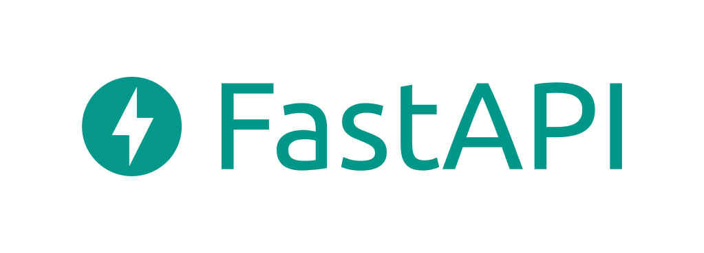

# FastAPI Base Project

Đây là một boilerplate (khung dự án) được xây dựng trên **FastAPI**, cung cấp một nền tảng vững chắc để phát triển các ứng dụng backend một cách nhanh chóng. Dự án đã được cấu hình sẵn với các tính năng cơ bản và cần thiết nhất, giúp bạn tiết kiệm thời gian thiết lập ban đầu và tập trung ngay vào logic nghiệp vụ.

---

## ✨ Tính năng nổi bật

Dự án này đã được tích hợp sẵn:

- **Framework:** FastAPI - Hiệu năng cao, dễ sử dụng.
- **Database:** Hỗ trợ **PostgreSQL** (>=12) và **SQLite** (để bắt đầu nhanh).
- **Migration:** Quản lý thay đổi cấu trúc database một cách an toàn với **Alembic**.
- **Authentication:** API Đăng nhập sử dụng **JWT**.
- **Authorization:** Decorator `login_required` và `permission_required` để bảo vệ endpoints.
- **User Management:** API CRUD cho User, API lấy thông tin cá nhân (`/me`) & cập nhật thông tin.
- **Pagination:** Hàm `paginate` tiện ích để phân trang kết quả API.
- **Logging:** Cấu hình sẵn hệ thống ghi log để theo dõi và debug.

---

## 💡 Tại sao chọn boilerplate này?

Boilerplate này được thiết kế để giúp bạn khởi tạo dự án FastAPI một cách nhanh chóng, tuân thủ các nguyên tắc phát triển tốt nhất. Với cấu trúc module rõ ràng, tích hợp sẵn các tính năng quan trọng như xác thực, phân quyền, quản lý người dùng và migration database, bạn có thể tập trung vào việc xây dựng logic nghiệp vụ mà không cần lo lắng về việc thiết lập ban đầu phức tạp. Đây là nền tảng lý tưởng cho các ứng dụng web API có khả năng mở rộng và dễ bảo trì.

---

## � Cài đặt và Khởi chạy

### Yêu cầu

- Python 3.8+
- PostgreSQL >= 12 (Tùy chọn, nếu không dùng SQLite)

### Các bước cài đặt

1.  **Clone dự án về máy của bạn:**

    ```bash
    git clone https://github.com/huutawn/fastapi-base.git
    cd fastapi-base
    ```

2.  **Tạo môi trường ảo và kích hoạt:**

    ```bash
    # Dành cho Windows
    python -m venv .venv
    .\.venv\Scripts\activate

    # Dành cho macOS/Linux
    python3 -m venv .venv
    source .venv/bin/activate
    ```

3.  **Cài đặt các thư viện cần thiết:**

    ```bash
    pip install -r requirements.txt
    ```

4.  **Cấu hình môi trường:**

    - Đổi tên file `.env.example` thành `.env`.
    - **Nếu dùng SQLite (mặc định):** Bạn không cần thay đổi gì. Một file `fastapi.db` sẽ được tự động tạo.
    - **Nếu dùng PostgreSQL:**
      - Cài đặt và khởi động PostgreSQL trên máy của bạn.
      - Tạo một database mới (ví dụ: `fastapi_db`).
      - Cập nhật biến `DATABASE_URL` trong file `.env` với thông tin của bạn:
        ```env
        DATABASE_URL=postgresql+psycopg2://<user>:<password>@<host>:<port>/<db_name>
        ```

5.  **Chạy Database Migration:**
    Lệnh này sẽ tạo các bảng cần thiết trong database dựa trên model của bạn.

    ```bash
    alembic upgrade head
    ```

6.  **Khởi chạy ứng dụng:**
    ```bash
    uvicorn app.main:app --reload
    ```

Bây giờ bạn có thể truy cập API tại `http://localhost:8000/docs` để xem tài liệu Swagger UI.

---

## 📂 Cấu trúc dự án

Dự án được tổ chức theo cấu trúc module rõ ràng để dễ dàng bảo trì và mở rộng.

```
fastapi-base/
│
├── alembic/              # Chứa các file migration của Alembic
├── app/                  # Thư mục code chính của ứng dụng
│   ├── core/             # Chứa các file cấu hình và bảo mật cốt lõi
│   ├── db/               # Thiết lập kết nối và base model cho SQLAlchemy
│   ├── domains/          # Chứa logic nghiệp vụ theo từng domain
│   │   └── users/        # Domain quản lý người dùng
│   │       ├── __init__.py
│   │       ├── mappers.py      # Chuyển đổi giữa model và schema
│   │       ├── models.py       # Model SQLAlchemy
│   │       ├── router.py       # Endpoints API
│   │       ├── schemas.py      # Schema Pydantic cho User
│   │       └── services.py     # Logic nghiệp vụ cho User
│   ├── helpers/          # Các module hỗ trợ (phân trang, exception handler...)
│   ├── main.py           # File khởi tạo ứng dụng FastAPI
│   └── routers.py        # Nơi đăng ký các router của domain
│
├── documents/            # Chứa các tài liệu hướng dẫn
│   └── CREATE_DB_GUIDE.md
│
├── .env                  # File biến môi trường (cần tạo từ .env.example)
├── alembic.ini           # Cấu hình của Alembic
├── Dockerfile            # Cấu hình để đóng gói ứng dụng với Docker
├── requirements.txt      # Danh sách các thư viện Python
└── README.md             # File bạn đang đọc
```

---

## 🗄️ Quản lý Database Migration

Dự án sử dụng **Alembic** để quản lý các thay đổi về cấu trúc database. Mỗi khi bạn thay đổi một model (thêm/sửa/xóa cột, bảng), bạn cần tạo một file migration mới và áp dụng nó.

Quy trình này đảm bảo rằng cấu trúc database của tất cả các thành viên trong nhóm và trên server production luôn đồng bộ với code.

Để xem hướng dẫn chi tiết về cách tạo một migration mới, vui lòng tham khảo tài liệu tại đây:
**➡️ [Hướng dẫn Tạo Bảng bằng Migration](./documents/CREATE_DB_GUIDE.md)**

---

## 📦 Triển khai (Deployment)

Dự án này đã được cấu hình sẵn với `Dockerfile` để dễ dàng đóng gói và triển khai ứng dụng của bạn trong môi trường container hóa như Docker hoặc Kubernetes.

Để xây dựng và chạy ứng dụng bằng Docker:

1.  **Xây dựng Docker Image:**
    ```bash
    docker build -t fastapi-base-app .
    ```
2.  **Chạy Docker Container:**
    ```bash
    docker run -p 8000:8000 fastapi-base-app
    ```
    Ứng dụng sẽ khả dụng tại `http://localhost:8000`. Đảm bảo rằng bạn đã cấu hình biến môi trường trong file `.env` hoặc truyền chúng vào container.

---

## 🤝 Đóng góp (Contributing)

Chúng tôi hoan nghênh mọi đóng góp để cải thiện boilerplate này! Nếu bạn có ý tưởng, phát hiện lỗi hoặc muốn thêm tính năng mới, vui lòng:

1.  Fork repository này.
2.  Tạo một branch mới cho tính năng/sửa lỗi của bạn (`git checkout -b feature/your-feature-name`).
3.  Thực hiện các thay đổi của bạn.
4.  Viết commit message rõ ràng.
5.  Tạo Pull Request.

---

## 📄 Giấy phép (License)

Dự án này được phát hành dưới Giấy phép MIT.
